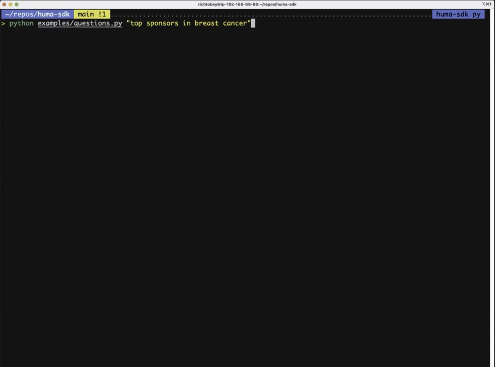

# HUMA-SDK - A Python Package for the HUMA-API

Huma-SDK is the Huma-API Software Development Kit (SDK) for Python, allowing developers to interact with the Huma-API services in their Python applications.

## Overview

This SDK simplifies the interaction with the HUMA-API, making it easy to integrate into your Python applications. It provides access to various modules, each with its set of functions for specific tasks.

## SDK Modules

- [**Questions**](docs/questions.md): Interact with question-related functionalities.
  - `submit_question`: Submit a question for answer calculation.
  - `check_question_status`: Retrieve the status of an answer calculation.
  - `fetch_answer`: Retrieve the calculated answer.

- [**Histories**](docs/histories.md): Access historical question data.
  - `fetch_history`: Retrieve a list of historical questions.
  - `fetch_history_data`: Retrieve detailed data for a historical question.
  - `submit_history_visual`: Initiate the transformation of historical question data into a file format.
  - `check_history_visual_status`: Check the status of the visual conversion process.
  - `fetch_history_visual_result`: Retrieve the outcome of a visual conversion.

- [**Subscriptions**](docs/subscriptions.md): Manage subscriptions to specific questions.
  - `fetch_subscriptions`: Retrieve a list of subscribed questions.
  - `create_subscription`: Subscribe to a question.
  - `fetch_subscription_status`: Get the subscription status of a question.
  - `fetch_subscription_data`: Retrieve detailed data for a subscribed question.
  - `delete_subscription`: Unsubscribe from a question.

- [**Favorites**](docs/favorites.md): Manage favorite questions.
  - `fetch_favorites`: Retrieve a list of favorite questions.
  - `create_favorite`: Mark a question as a favorite.
  - `fetch_favorite_data`: Retrieve detailed data for a favorite question.
  - `delete_favorite`: Remove a question from favorites.

- [**Quicklinks**](docs/quicklinks.md): Access categorized quicklinks for question submission.
  - `fetch_quicklinks`: Enables users to retrieve categorized quicklinks, which are question titles that users can utilize.

- [**Audits**](docs/audits.md): Retrieve audit trail logs.
  - `fetch_audits`: Retrieve audit trail logs.

- [**Aliases**](docs/aliases.md): Manage aliases for rules.
  - `fetch_aliases`: Retrieve aliases.

- [**Webhooks**](docs/webhooks.md): Managing the webhook callbacks.
  - `activate_webhook_client`: Activate flask app on local environment for receiving webhook callbacks

## Quickstart - Polling

### Step-by-Step Instructions to Setup and Activate a Python Envionment for Mac, Linux or WSL mode in Windows

1. Register a username and create a API key on the front end.  
    - Navigate to [https://demo.huma.ai](https://demo.huma.ai),
    - Register your email and provide a password.  Only approved emails can register.
    - Receive verification code in email
    - Return to registration code and enter your verification code and click 'Confirm Account,'
    - Naviate to hamburger menu > Developer Settings > API Tokens > Create a token with Questions permission and save out the api key provided.

2. Open a linux based terminal.

3. Run the environment creation script from the root directory of the project linux based environment:

    ```bash
    cd huma-sdk
    /bin/bash scripts/build_conda.sh
    # follow the instructions
    conda activate huma-sdk
    ```

4. Create your .env to hold your API key and other settings

    Before you start, create a `.env` file from `sample.env` and update it with your credentials.

    ```bash
    cp sample.env .env
    vim .env  # then i to enter insert mode
    # change the first two items in your .env file
    API_URL=<api url>
    API_SECRET_KEY=<api token>
    API_CALLBACK_AUTH=<authorization token for webhook>
    FLASK_APP=examples/webhooks:main
    # ':wq<enter>' to save out your changes
    ```

      Access and Config Info Explanations

      - API_URL is the url of your environment proceeded by api.  It could also be `https://api.demo.huma.ai`
      - API_SECRET_KEY is what you get from the `Huma Platform > Hamburger menu > Developer Settings > API Tokens` when you create an API screen.
      - API_CALLBACK_AUTH is an authorization code that you provide when you register a webhook in `Huma Platform > Hamburger menu > Developer Settings > Webhooks`
      - FLASK_APP=examples/webhooks:main is for the webhook client.  If you run the debugger profile form .vscode/launch.json in the VS Code debugger, this directs Flask where to start the code from.

5. Run the Questions Script (or another one)

    ```bash
    python examples/questions.py "top sponsors in nsclc"
    ```

    The system will submit the question, poll for the results and then display and save them.

Here is a video of the above steps:

<a href="https://drive.google.com/file/d/1xcYfPcwdmcmElH8R7LfNe2-AMgj2rXJj/view?usp=drive_link" target="_blank">
    
</a>

## Webhooks

There are [instructions](docs/webhooks.md) and [example code](examples/webhooks.py) on how to setup a webhook callback to receive callback notifications after you call an API submit endpoint.
